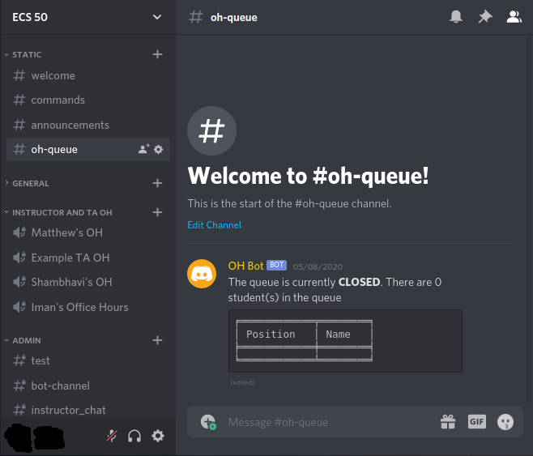
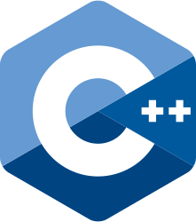
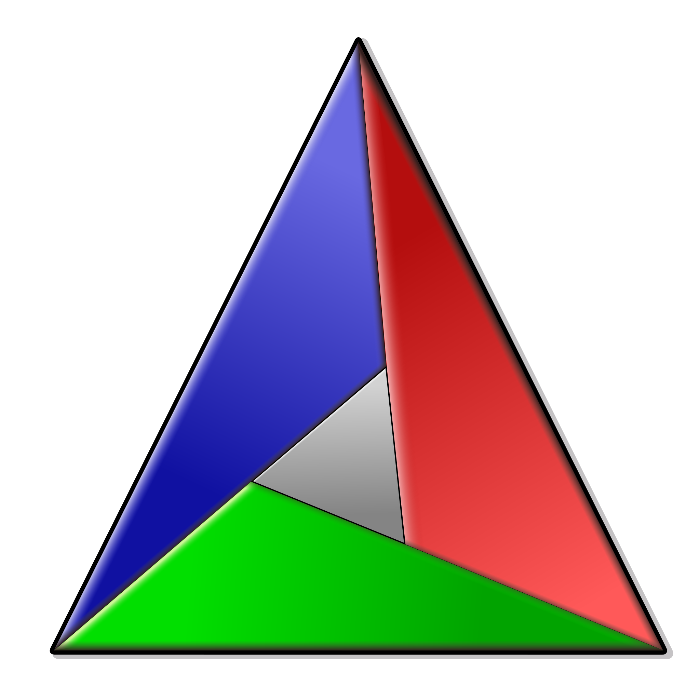

## Personal Projects 

---
### [Discord Bot for Office Hours](https://github.com/ECS-OH-Bot/OH-Bot)
A system to help manage office hours for university classes during the COVID-19 pandemic

### [BEETS](https://github.com/stott531/BEETS)
Basic End to End Testing Software

---
### [Hexagonal Minesweeper](https://github.com/NoahRoseLedesma/thick-turtle)
A fun twist on a timeless classic

---
### [Mandelbrot Set Generator](https://github.com/stott531/MandelbrotGenerator)
An exploration of computer graphics

---

## Languages

    

      
      
      
    

## Familiar Libraries

   

      
      
      
   

## Tool-Chains

   

      
      
      
   

---

